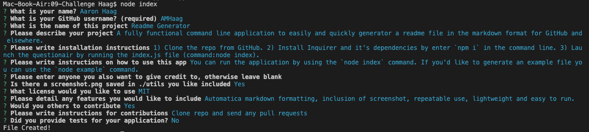

# Readme Maker
## Description
A fully functional command line application to quickly and easily create readme files for projects in the markdown format.

## License
  

You can read the details of the MIT license [here](https://choosealicense.com/licenses/mit/)

## Table of Contents
### - [Installation](#installation)
### - [Usage](#Usage)
### - [Credits](#Credits)
### - [Features](#features)
### - [How to Contribute](#how-to-contribute)
### - [Tests](#tests)

## Installation
To install first clone the repo and be sure to have Node.js installed. Then install the dependencies using the `npm i` command. This will install the Inquier package and it's dependencies, read more about inquirer [here.](https://www.npmjs.com/package/inquirer)
## Usage
You can run the application and create your own readme file using the `node index` command. You can also generate an example file by entering the `node example` command instead. Your readme.md file will be saved in the topmost folder of this repo.

You can also watch [this video](https://drive.google.com/file/d/1m4VJdnDlw9vKVk6Z-2WCGZCvaYnWzl4F/view?usp=sharing) demonstration. 

## Credits
(Aaron Haag)[https://github.com/AMHaag]

## Features
Automatic markdown formatting, repeatable use and consistent styling for readme files that is lightweight easy to run. 

## How to Contribute
Please clone the repo and submit any pull requests with details on changes made. 

## Tests
You can run a dummy test by enter the `node example` command. You can also change the mockData object in example.js file to see different options rendered.
